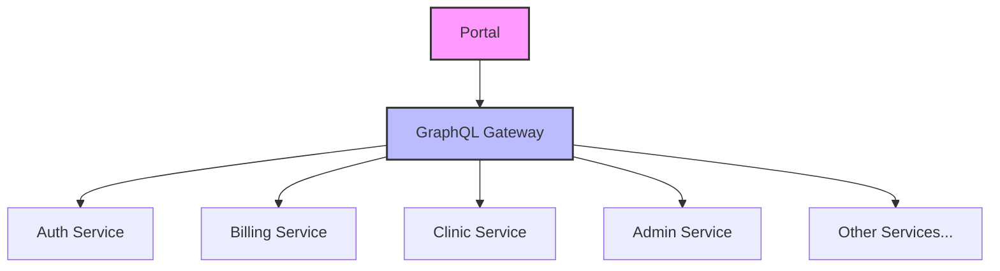

# 👋 Welcome to the [PORTAL_NAME] Portal Documentation

Last Updated: April 22, 2025

## Overview

This documentation details the [PORTAL_NAME] portal within the BTCY BioFlux ecosystem, focusing on its technical implementation, integrations, and usage patterns.

---

## 🛠 Portal Details

- **Portal Name**: [PORTAL_NAME]
- **Version**: [VERSION]
- **Repository**: [REPO_LINK]
- **Deployment URL**: [DEPLOYMENT_URL]
- **Portal Type**: [PORTAL_TYPE] (Admin/Patient/Clinic/etc.)

---

## 📊 Architecture Overview

The [PORTAL_NAME] Portal interacts with these microservices through Apollo Federation Gateway:

---

## 🔑 Primary Flows

- [Flow 1 - Description]
- [Flow 2 - Description]
- [Flow 3 - Description]

---

## 🖥️ Frontend Implementation

### Core Components
- [Component 1] - Purpose and usage
- [Component 2] - Purpose and usage

### Global State Management
- State stores and their purpose
- Redux/Context structure

### Routes
- Main application routes and access control

### GraphQL Integration
- Key queries and mutations
- Apollo Client implementation

---

## ⚙️ Backend Integration

### Microservices Used
- Auth Service - Authentication endpoints used
- Billing Service - Payment processing endpoints used
- [Other Services] - Specific endpoints used

### Data Models
- Key data structures and relationships
- Database schemas referenced

### Third-Party Integrations
- [Integration 1] - Purpose and implementation details
- [Integration 2] - Purpose and implementation details

---

## 🔄 Related Portals

- [Related Portal 1] - Integration points
- [Related Portal 2] - Integration points

---

## 🙋 Support & Maintenance

- **Team**: [TEAM_NAME]
- **Primary Contact**: [CONTACT_PERSON]
- **Email**: [CONTACT_EMAIL]