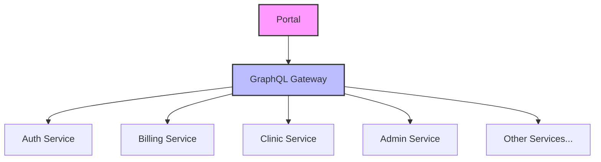

# 👋 Welcome to the [PORTAL_NAME] Documentation

Last Updated: April 23, 2025

## 🌟 Overview

This documentation details the [PORTAL_NAME] portal within the BTCY BioFlux ecosystem, focusing on its technical implementation, integrations, and usage patterns.

---

## 🛠 Portal Details

- **Portal Name**: [PORTAL_NAME]
- **Version**: [VERSION]
- **Repository**: [REPO_LINK]
- **Deployment URL**: [DEPLOYMENT_URL]
- **Portal Type**: [PORTAL_TYPE] (Admin/Patient/Clinic/etc.)

---

## 📊 Architecture Overview

The [PORTAL_NAME] Portal is built on a modern frontend framework that interacts with BTCY BioFlux microservices through Apollo Federation Gateway:

**Key Architecture Documentation:**

- [System Architecture Overview](System-Architecture)
- [Frontend Architecture](Frontend-Architecture)
- [Backend Architecture](Backend-Architecture)

---

## Business Logic - 🔑 Primary Flows

For a comprehensive view of the key user journeys and application flows, please visit our [Primary Flows](Business-Logic-Primary-Flows) documentation.

---

## 🖥️ Frontend Implementation

The [PORTAL_NAME] frontend is built on [FRAMEWORK] with a component-based architecture.

### Key Frontend Resources

- [Routing](Frontend-Routing)

---

## ⚙️ Backend Integration

The [PORTAL_NAME] integrates with multiple backend microservices via GraphQL.

### Key Backend Resources

- [Backend Integrations](Backend-Integrations)

---

## GraphQL

The [PORTAL_NAME] uses GraphQL for data fetching and mutations.

### Key GraphQL Resources

- [🔗 GraphQL Queries](GraphQL-Queries)
- [🔗 GraphQL Mutations](GraphQL-Mutations)

---

## 🤝 Related Services

- [Related Portals](Related-Portals)

---

## 🙋 Support & Maintenance

- **Team**: [TEAM_NAME]
- **Primary Contact**: [CONTACT_PERSON]
- **Email**: [CONTACT_EMAIL]
