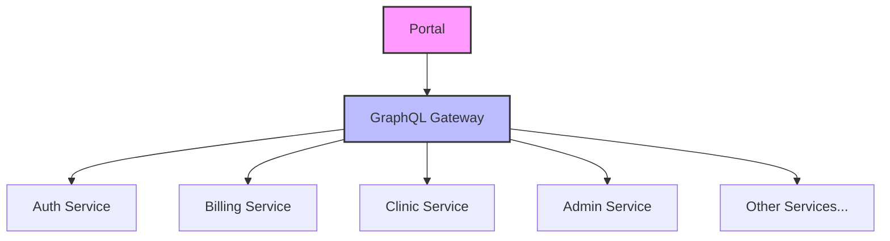

# 👋 Welcome to the Portal Documentation

Last Updated: April 22, 2025

## Overview

This documentation provides comprehensive information about the [PORTAL_NAME] portal, its architecture, integration with backend services, and usage guidelines. This portal is part of the BTCY BioFlux ecosystem and interacts with various microservices.

---

## 🛠 Portal Details

- **Portal Name**: [PORTAL_NAME]
- **Version**: [VERSION]
- **Repository**: [REPO_LINK]
- **Deployment URL**: [DEPLOYMENT_URL]
- **Type**: [PORTAL_TYPE] (Admin/Patient/Clinic/etc.)

---

## 📊 Architecture & Integration

The [PORTAL_NAME] Portal interacts with several backend microservices through Apollo Federation Gateway. Below is a visualization of these interactions:

For detailed integration information, see the [Service Integration](sections/Integration/Services) page.

---

## 🔑 Key Features

- [Feature 1]
- [Feature 2]
- [Feature 3]
- [Feature 4]

---

## 📚 Documentation Sections

- [Architecture Overview](sections/Architecture/Overview)
- [Service Integration](sections/Integration/Services)
- [Authentication Flow](sections/Architecture/Authentication-Flow)
- [User Guides](sections/Usage/User-Guides)
- [Development Setup](Development-Setup)
- [Deployment Guide](Deployment-Guide)

---

## 🔄 Related Portals

This portal works in conjunction with:

- [Related Portal 1]
- [Related Portal 2]

---

## 🙋 Support & Maintenance

For issues related to this portal, contact:

- **Team**: [TEAM_NAME]
- **Primary Contact**: [CONTACT_PERSON]
- **Email**: [CONTACT_EMAIL]

For urgent production issues, refer to the [Troubleshooting](Troubleshooting) guide.