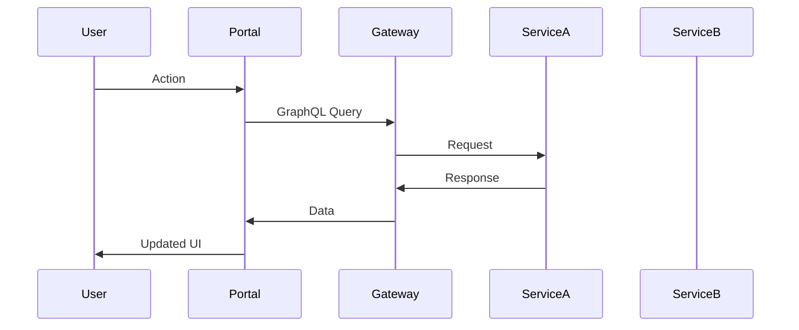
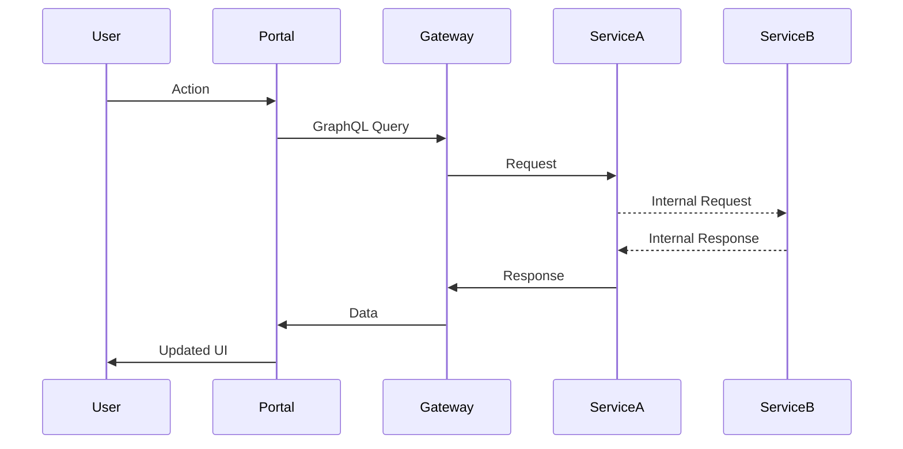

# 🔑 Primary Flows in [PORTAL_NAME]

This document outlines the main user journeys and technical flows in the [PORTAL_NAME] portal.

## Flow 1: [Flow Name]

### User Journey
1. User starts at [starting point]
2. User performs [action]
3. System responds with [response]
4. [Additional steps...]

### Technical Implementation
- **Components Involved**: [List of components]
- **GraphQL Operations**: 
  - Query: `[QUERY_NAME]`
  - Mutation: `[MUTATION_NAME]`
- **Microservices**: 
  - [Service 1] - Endpoint: `[ENDPOINT]`
  - [Service 2] - Endpoint: `[ENDPOINT]`
- **State Changes**:
  - [State 1] → [New State 1]
  - [State 2] → [New State 2]

---

## Flow 2: [Flow Name]

### User Journey
1. User starts at [starting point]
2. User performs [action]
3. System responds with [response]
4. [Additional steps...]

### Technical Implementation
- **Components Involved**: [List of components]
- **GraphQL Operations**: 
  - Query: `[QUERY_NAME]`
  - Mutation: `[MUTATION_NAME]`
- **Microservices**: 
  - [Service 1] - Endpoint: `[ENDPOINT]`
  - [Service 2] - Endpoint: `[ENDPOINT]`
- **State Changes**:
  - [State 1] → [New State 1]
  - [State 2] → [New State 2]

---

## Error Handling for Critical Flows

### Common Error Scenarios
- **Error 1**: [Description]
  - **Cause**: [Explanation]
  - **Handling**: [How it's handled]
  
- **Error 2**: [Description]
  - **Cause**: [Explanation]
  - **Handling**: [How it's handled]

---

## Performance Considerations

- **Caching Strategy**: [Description]
- **Lazy Loading**: [Components/Routes that implement lazy loading]
- **Optimistic UI Updates**: [Where implemented]