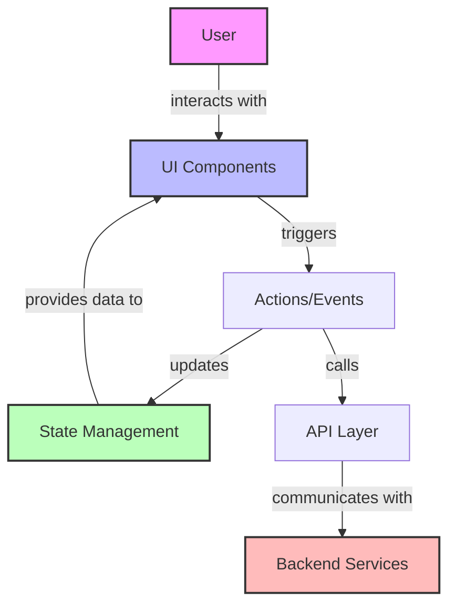
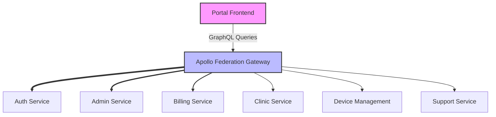
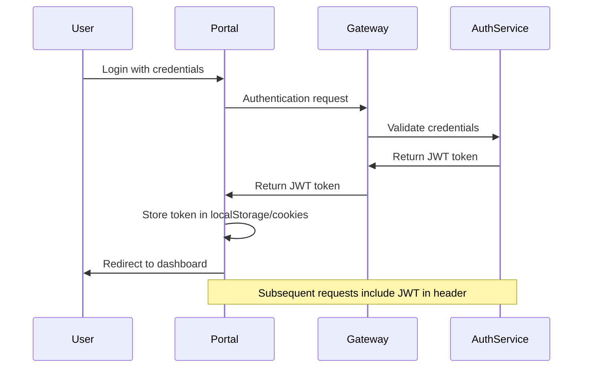
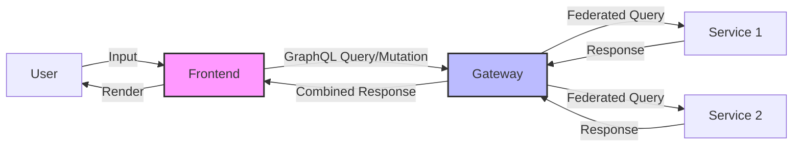

# Architecture Overview

Last Updated: April 22, 2025

## Introduction

The [PORTAL_NAME] portal is built using [FRONTEND_FRAMEWORK] and interacts with the BTCY BioFlux backend microservices ecosystem. This document provides an overview of the portal's architecture and its integration with the backend services.

## Portal Architecture

### Frontend Technology Stack

- **Framework**: [FRAMEWORK] (React/Angular/Vue)
- **State Management**: [STATE_MANAGEMENT] (Redux/MobX/Vuex/etc.)
- **UI Library**: [UI_LIBRARY] (Material-UI/Ant Design/etc.)
- **API Client**: [API_CLIENT] (Apollo Client/Relay/etc.)
- **Build Tool**: [BUILD_TOOL] (Webpack/Vite/etc.)

### Frontend Architecture Diagram

## Integration with Backend Services

The [PORTAL_NAME] portal primarily interacts with backend services through the GraphQL Gateway, which federates schemas from multiple microservices.

### Service Dependencies

### Key Service Integrations

| Service | Purpose | Features Used |
|---------|---------|--------------|
| Auth Service | User authentication and authorization | Login, Registration, JWT handling |
| Admin Service | Administrative operations | User management, System settings |
| Billing Service | Billing and payments | Payment processing, Invoicing |
| Clinic Service | Clinic management | Appointment scheduling, Patient records |
| Device Management | Device operations | Device monitoring, Provisioning |
| Support Service | User support | Ticket management, Knowledge base |

## Authentication Flow

The portal uses JWT-based authentication, following this flow:

For more details on authentication, see [Authentication Flow](Authentication-Flow).

## Data Flow Architecture

## Related Documentation

- [Component Structure](Component-Structure)
- [Service Integration Details](../Integration/Services)
- [API Usage Examples](../Integration/API-Examples)
- [Backend Architecture](../../ERP-Backend-Architecture)