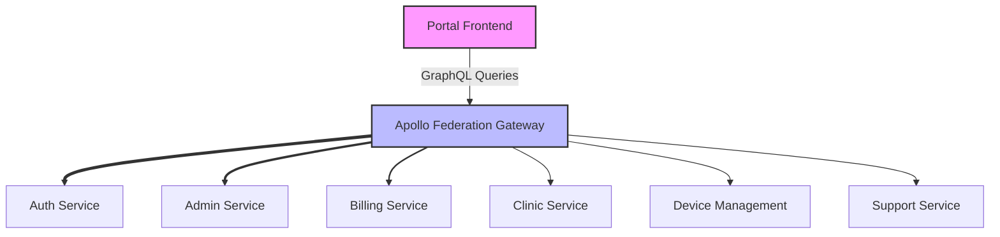

# System Services Architecture

Last Updated: April 22, 2025

## Introduction

This document focuses on the [PORTAL_NAME] system's service architecture, detailing how the various backend microservices are organized and interact with each other.

## Service Architecture

The BTCY BioFlux ecosystem utilizes a microservices architecture, with each service focusing on a specific domain capability.

### Service Dependencies

## Key Service Details

### GraphQL Gateway

The GraphQL Gateway serves as the entry point for frontend-to-backend communication, implementing Apollo Federation to unify schemas from multiple backend services.

### Key Services

| Service           | Purpose                               | Key Features                            |
| ----------------- | ------------------------------------- | --------------------------------------- |
| Auth Service      | User authentication and authorization | Login, Registration, JWT handling       |
| Admin Service     | Administrative operations             | User management, System settings        |
| Billing Service   | Billing and payments                  | Payment processing, Invoicing           |
| Clinic Service    | Clinic management                     | Appointment scheduling, Patient records |
| Device Management | Device operations                     | Device monitoring, Provisioning         |
| Support Service   | User support                          | Ticket management, Knowledge base       |

## Service Communication Patterns

Services communicate primarily through:

1. Direct GraphQL federation through the gateway
2. Message queues for asynchronous events
3. Service-to-service REST APIs for specific operations

## Related Documentation

- [Frontend Architecture](Architecture-Frontend)
- [Backend Architecture](Architecture-Backend)
