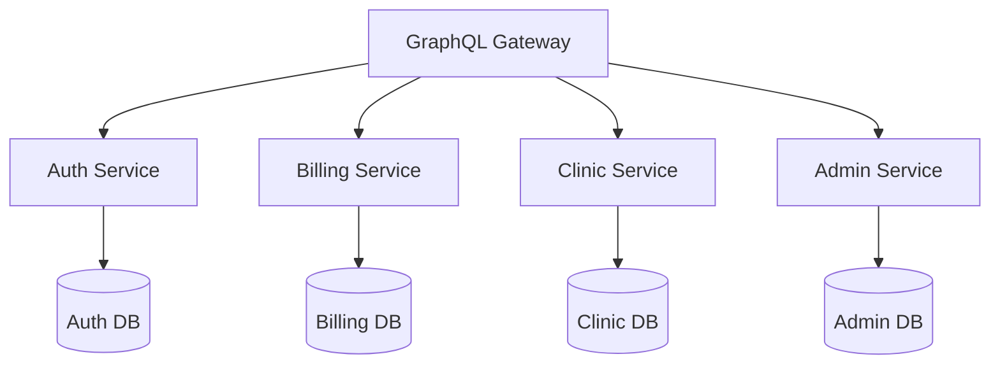

# Backend Architecture Overview

This section covers the backend architecture of the services supporting the [PORTAL_NAME] portal.

## Microservices Architecture

The backend is built on a microservices architecture with the following key services:

- Auth Service
- Billing Service
- Clinic Service
- Admin Service
- Support Service

## Technology Stack

- Runtime: Node.js
- API Layer: GraphQL (Apollo Server)
- Database: MongoDB
- Message Queue: [MESSAGE_QUEUE]
- Caching: [CACHING_SOLUTION]

## Architecture Diagram

## Design Principles

- [PRINCIPLE_1]
- [PRINCIPLE_2]
- [PRINCIPLE_3]

## Related Pages

- [Service Structure](Service-Structure)
- [Data Models](../Data-Models)
- [API Documentation](../../Integration/API-Documentation)

