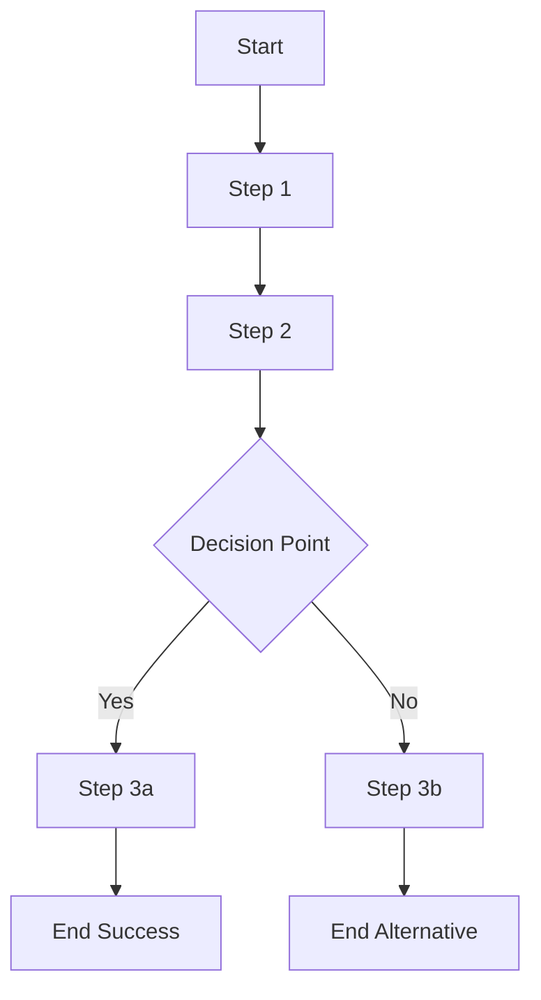

# Flow 2: [Name of Flow]

## Overview

A brief description of what this flow accomplishes in the system. Explain the business purpose and importance of this flow.

## Actors

- **Primary Actor**: [e.g., Patient, Physician, Administrator]
- **Secondary Actors**: [e.g., System, Database, Third-party services]

## Preconditions

- List of conditions that must be met before this flow can be executed
  - [Precondition 1]
  - [Precondition 2]

## Flow Diagram

## Process Steps

1. **[Step 1 Name]**
   - Description: Detailed explanation of this step
   - Input: Data inputs required for this step
   - Processing: Business logic applied during this step
   - Output: Results produced by this step
   - Error Handling: How errors are managed at this step

2. **[Step 2 Name]**
   - Description: Detailed explanation of this step
   - Input: Data inputs required for this step
   - Processing: Business logic applied during this step
   - Output: Results produced by this step
   - Error Handling: How errors are managed at this step

3. **[Decision Point]**
   - Condition: What determines the branch taken
   - If yes: Proceed to Step 3a
   - If no: Proceed to Step 3b

4. **[Step 3a/3b Name]**
   - Description: Detailed explanation of this step
   - Input: Data inputs required for this step
   - Processing: Business logic applied during this step
   - Output: Results produced by this step
   - Error Handling: How errors are managed at this step

## Post-conditions

- **Success Scenario**:
  - [Post-condition 1]
  - [Post-condition 2]
- **Alternative Scenario**:
  - [Alternative Post-condition 1]
  - [Alternative Post-condition 2]

## Business Rules

- **BR-1**: [Description of business rule 1]
- **BR-2**: [Description of business rule 2]

## API Endpoints Used

- `POST /api/endpoint1`: Creates/updates [resource]
- `GET /api/endpoint2`: Retrieves [resource] information

## Data Models Involved

- **Model 1**: [Brief description and key fields]
- **Model 2**: [Brief description and key fields]

## Edge Cases and Exception Handling

- **Edge Case 1**: [Description of edge case and how it's handled]
- **Edge Case 2**: [Description of edge case and how it's handled]

## Related Flows

- [Flow 2 Name]: [Brief description of relationship]
- [Flow 3 Name]: [Brief description of relationship]

## Notes and Considerations

- Any additional information that's important for understanding this flow
- Performance considerations
- Security considerations
- Compliance requirements

## Change History

| Date | Version | Author | Description of Change |
|------|---------|--------|------------------------|
| YYYY-MM-DD | 1.0 | [Name] | Initial documentation |
