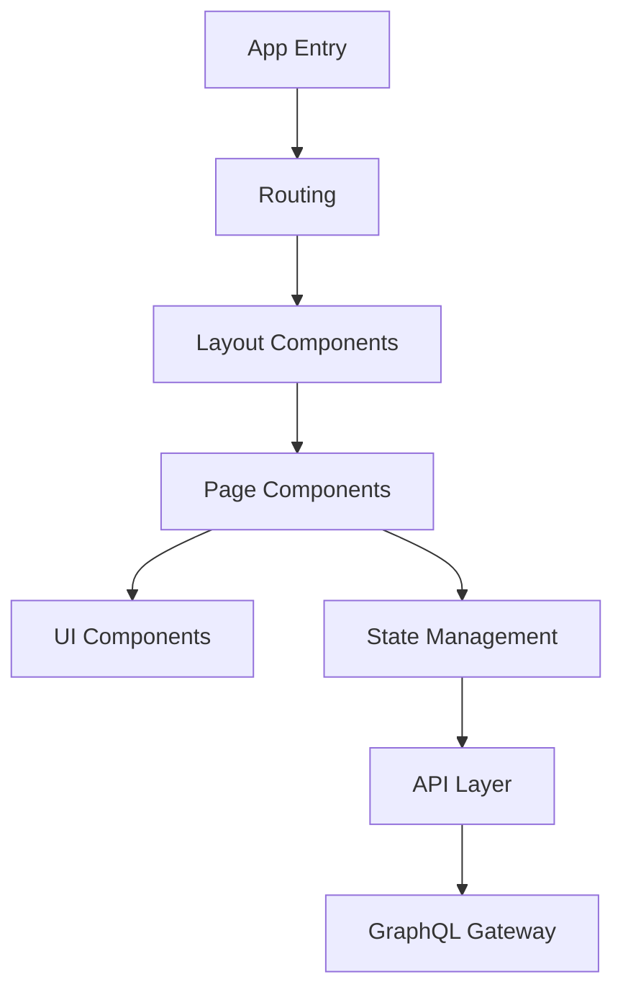

# Frontend Architecture Overview

This section covers the frontend architecture of the [PORTAL_NAME] portal.

## Key Components

- React Application Structure
- State Management (Redux/Context API)
- Component Library
- Routing System
- API Integration Layer

## Technology Stack

- Framework: React
- State Management: [STATE_MANAGEMENT_SOLUTION]
- UI Library: [UI_LIBRARY]
- Router: [ROUTER_LIBRARY]
- Testing: [TESTING_LIBRARIES]

## Architecture Diagram

## Design Principles

- [PRINCIPLE_1]
- [PRINCIPLE_2]
- [PRINCIPLE_3]

## Related Pages

- [Component Structure](Component-Structure)
- [State Management](State-Management)
- [Responsive Design](Responsive-Design)

