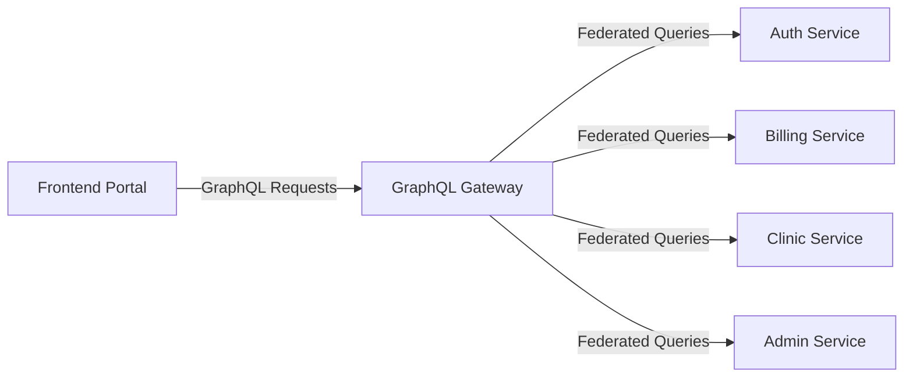

# Frontend-Backend Integration

This document outlines how the frontend portal interfaces with backend services.

## Integration Architecture

The frontend communicates with backend services through a GraphQL Gateway, which aggregates multiple microservices using Apollo Federation.



## Authentication Flow

1. User enters credentials in the frontend
2. Frontend sends authentication request to Auth Service via GraphQL Gateway
3. Auth Service validates credentials and returns JWT token
4. Frontend stores token and includes it in the Authorization header for subsequent requests
5. GraphQL Gateway validates token for each request before forwarding to appropriate services

## Data Flow

### Request Flow
1. User action triggers data request in the frontend
2. Frontend constructs GraphQL query/mutation
3. Query is sent to GraphQL Gateway with authentication headers
4. Gateway resolves the query across federated services
5. Data is returned to frontend

### Response Handling
1. Frontend receives GraphQL response
2. Data is processed and stored in application state
3. UI is updated to reflect new data
4. Error handling is applied if necessary

## API Usage Examples

### Sample Authentication Query
```graphql
mutation Login($input: LoginInput!) {
  login(input: $input) {
    token
    user {
      id
      name
      email
      roles
    }
  }
}
```

### Sample Data Query
```graphql
query GetPatientData($patientId: ID!) {
  patient(id: $patientId) {
    id
    name
    dateOfBirth
    medicalRecords {
      id
      date
      diagnosis
      treatment
    }
  }
}
```

## Related Documentation

- [GraphQL Gateway](GraphQL-Gateway)
- [API Documentation](API-Documentation)
- [Authentication Flow](Authentication-Flow)
- [Frontend State Management](../Frontend/Architecture/State-Management)
- [Backend Services Overview](../Backend/Services/Overview)