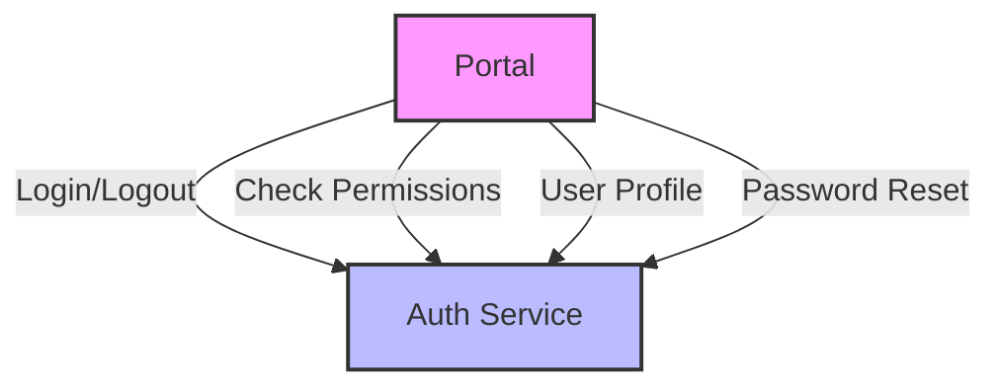
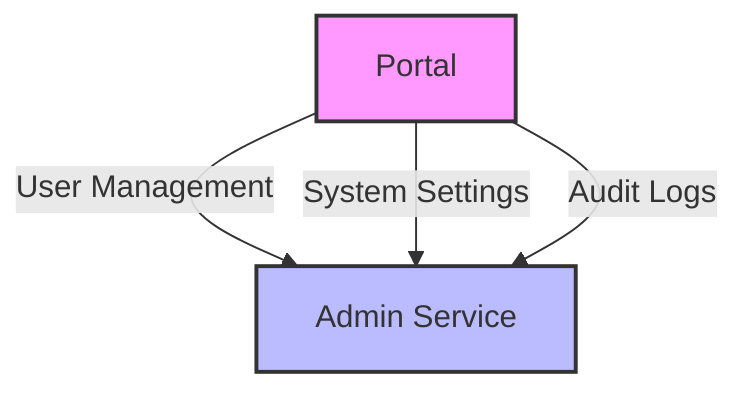
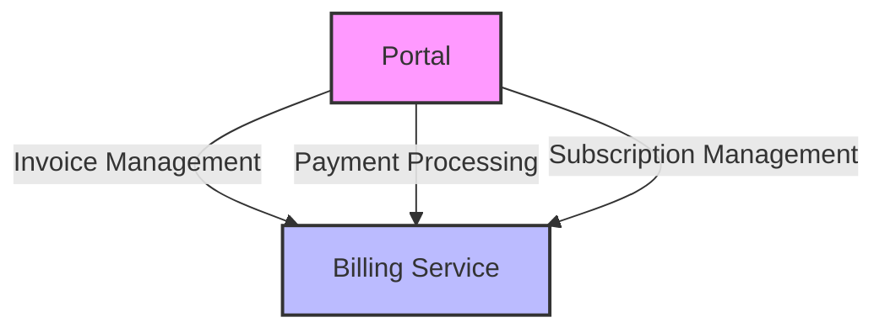

# Service Integration

Last Updated: April 22, 2025

## Overview

This document details how the [PORTAL_NAME] portal integrates with various backend microservices through the Apollo Federation GraphQL Gateway. Understanding these integrations is crucial for developers working on the portal.

## Service Dependencies Matrix

Below is a comprehensive mapping of the portal's dependencies on backend services:

| Service | Dependency Level | Primary Features Used | GraphQL Entities |
|---------|-----------------|----------------------|------------------|
| Auth Service | **High** | User authentication, authorization, role management | `User`, `Role`, `Permission` |
| Admin Service | **Medium/High** | User management, system configuration | `AdminUser`, `SystemConfig` |
| Billing Service | **Medium** | Payment processing, invoicing | `Invoice`, `Payment`, `Subscription` |
| Clinic Service | **Medium/Low** | Clinic profiles, practitioner management | `Clinic`, `Practitioner`, `Schedule` |
| Device Management | **Medium** | Device provisioning, monitoring | `Device`, `DeviceMetrics`, `DeviceStatus` |
| Support Service | **Low** | Ticket management | `Ticket`, `KnowledgeArticle` |

## Detailed Service Integration

### Auth Service Integration



**Key GraphQL Operations:**
- `login(username: String!, password: String!): AuthPayload`
- `logout: Boolean`
- `me: User`
- `hasPermission(permission: String!): Boolean`

**Implementation Details:**
- JWT tokens are stored in [STORAGE_METHOD] (localStorage/cookies)
- Token refresh mechanism uses [REFRESH_METHOD]
- Role-based access control is implemented using [RBAC_METHOD]

### Admin Service Integration



**Key GraphQL Operations:**
- `getUsers(filter: UserFilter): [User]`
- `createUser(input: UserInput!): User`
- `updateSystemSettings(input: SystemSettingsInput!): SystemSettings`
- `getAuditLogs(filter: AuditLogFilter): [AuditLog]`

### Billing Service Integration



**Key GraphQL Operations:**
- `getInvoices(filter: InvoiceFilter): [Invoice]`
- `processPayment(input: PaymentInput!): PaymentResult`
- `getSubscriptions(filter: SubscriptionFilter): [Subscription]`

## GraphQL Query Examples

### Example: User Authentication

```graphql
mutation Login($username: String!, $password: String!) {
  login(username: $username, password: $password) {
    token
    refreshToken
    user {
      id
      username
      email
      roles {
        name
        permissions {
          name
          resource
        }
      }
    }
  }
}
```

### Example: Fetching User Data with Billing Information

```graphql
query GetUserWithBilling($userId: ID!) {
  getUser(id: $userId) {
    id
    username
    email
    profile {
      firstName
      lastName
    }
    # From Billing Service (federated)
    invoices {
      id
      amount
      status
      dueDate
    }
    subscriptions {
      id
      plan
      status
      nextBillingDate
    }
  }
}
```

## Error Handling Strategies

The portal implements the following strategies for handling service integration errors:

1. **Network Errors**: [NETWORK_ERROR_STRATEGY]
2. **Authentication Errors**: [AUTH_ERROR_STRATEGY]
3. **Service Unavailability**: [SERVICE_UNAVAILABLE_STRATEGY]
4. **Data Validation Errors**: [VALIDATION_ERROR_STRATEGY]

## Service Versioning and Compatibility

The portal is currently compatible with these service versions:

- Auth Service: v[VERSION]
- Admin Service: v[VERSION]
- Billing Service: v[VERSION]
- Clinic Service: v[VERSION]
- Device Management: v[VERSION]
- Support Service: v[VERSION]

For information on handling service version changes, see [Service Versioning Strategy](Service-Versioning).

## Related Documentation

- [API Usage Examples](API-Examples)
- [Authentication Flow](../Architecture/Authentication-Flow)
- [Error Handling Guide](Error-Handling)
- [Backend Service Documentation](../../ERP-Backend-Services)